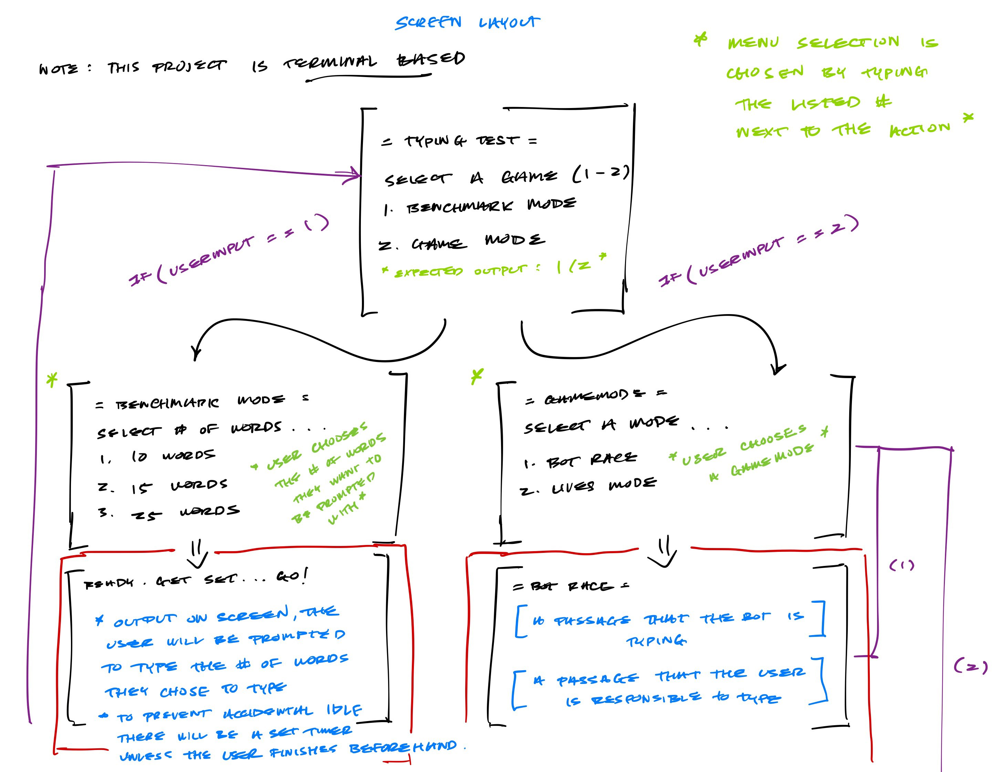
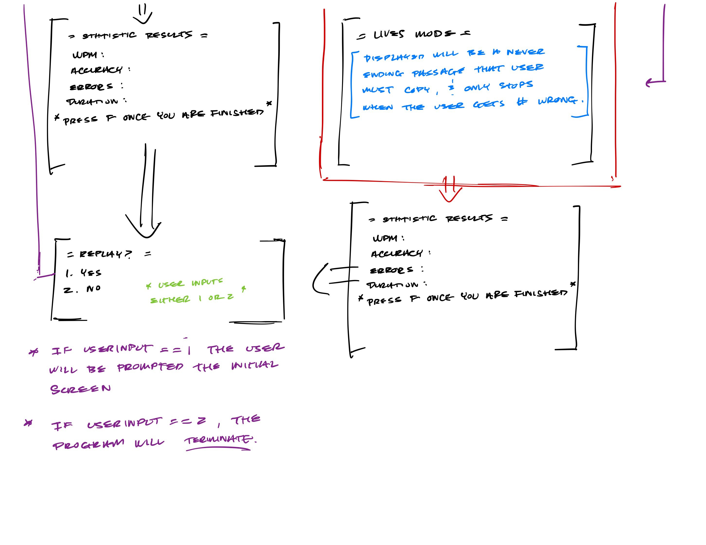

# Text Scramble
 
> Authors: [Brandon Vo](https://github.com/bxnvo)
> [Matthew Chun](https://github.com/matthwchun)
> [Randall Nguyen](https://github.com/1rwen)
> [Willa Ralston](https://github.com/chairfu)

## Project Description
This is important because it develops useful skills for coding such as accuracy and speed which is useful for completing tasks quickly. Furthermore, typing is an important part of computer literacy and practice can help groups from kids to adults in computer classes. In addition, typing tests that check for mistakes while timed check your ability to read quickly and spelling accurately. Comfortability with typing can enhance productivity, increase confidence and aptitude with digital tools, and reduce typing fatigue by reducing the need to look at the keyboard while working. Overall, typing tests are a fun way for people to engage with typing practice that has useful metrics and can enhance your time spent online. 
- language/tools: c++, possible gui tentatively (such as qt)
- input - user typing  /// output - score for game, accuracy percentage, words per minute output, most commonly missed chracters, most frequent errors
features
- typing feedback/analysis : determine metrics such as typing speed, accuracy, common errors, avg time to complete passage (based on modes)
- different test modes: timed passage, how many words can be typed in a minute or two minutes or other time periods, multiple difficulties of passages, blind typing (where user input is hidden for the duration of the test), themed passages
- shooting for fun game modes: timed mode (ex: type given word in 5 seconds to get a point, three failed attempts ends game), race against bot
- try for basic gui if enough time: echo text as user types next to passage and color code green/red for correct or incorrect spelling

 > ## Phase II
 > In addition to completing the "User Interface Specification" and "Class Diagram" sections below, you will need to:
 > * Create an "Epic" (note) for each feature. Place these epics in the `Product Backlog` column
 > * Complete your first *sprint planning* meeting to plan out the next 7 days of work.
 >   * Break down the "Epics" into smaller actionable user stories (i.e. smaller development tasks). Convert them into issues and assign them to team members. Place these in the `TODO` (aka Sprint Backlog) column.
 >   * These cards should represent roughly 7 days worth of development time for your team. Then, once the sprint is over you should be repeating these steps to plan a new sprint, taking you until your second scrum meeting with the reader in phase III.
 > * Schedule two check-ins using Calendly. You need to pick both time slots on Tuesday of week 6. The check-ins will occur on Zoom. Your entire team must be present for both check-ins.
 >   * The first check-in needs to be scheduled with your lab TA. During that meeting, you will discuss your project design/class diagram from phase II.
 >   * The second check-in should be scheduled with a reader. During that meeting you will discuss:
 >     * The tasks you are planning for the first sprint
 >     * How work will be divided between the team members
## User Interface Specification

### Navigation Diagram

### Screen Layouts

## Class Diagram

This is the current version of our uml diagram. At the top is the word namespace (shown as a uml package) which will house all of the various helper functions for reading in text from a .txt file and storing it as either a string or a vector<string> depending on the mode. Our mode is the base class which will take in a username (login) and check to see if it is already present. If it is, it will load that profile and if not, it will create a new profile. The profile class is the composite of the stats class and this will contain all of the stats that will be measured in all of the modes (wpm, accuracy, errors, etc.). In addition to the stats, the profile will have a specific username associated with it to facilitate different users. To that end, it has a writeProfile() and readProfile() method which will write user info to a file and read it in respectively. Going back to the mode class, it has other basic functions such as calculating the accuracy, errors and wpm that will be used in all three derived classes. The first derived class is our benchmark mode which will output different passages based on the type and word count. It will then start a timer and measure how long it takes the user to input the passage correctly recording errors as it goes. The next derived class is a life-based game mode. It will keep a score based on how many words are finished before time runs out using the timedWord() method and the setScore() method. The timedWord() function will track if the user can type in a word in a certain time interval and take away lives every time the user fails. This class uses a wordList which is a vector of strings and will be generated from functions in the word namespace. The final class is the botRace class which will randomly generate a wpm to use for the bot. It will then compare the time you take to finish the passage to the bot and write the win/loss record. 
 
 > ## Phase III
 > You will need to schedule a check-in for the second scrum meeting with the same reader you had your first scrum meeting with (using Calendly). Your entire team must be present. This meeting will occur on Zoom and should be conducted by Wednesday of week 8.
 
 > BEFORE the meeting you should do the following:
 > * Update your class diagram from Phase II to include any feedback you received from your TA/grader.
 > * Considering the SOLID design principles, reflect back on your class diagram and think about how you can use the SOLID principles to improve your design. You should then update the README.md file by adding the following:
 >   * A new class diagram incorporating your changes after considering the SOLID principles.
 >   * For each update in your class diagram, you must explain in 3-4 sentences:
 >     * What SOLID principle(s) did you apply?
 >     * How did you apply it? i.e. describe the change.
 >     * How did this change help you write better code?
 > * Perform a new sprint plan like you did in Phase II.
 > * You should also make sure that your README file (and Project board) are up-to-date reflecting the current status of your project and the most recent class diagram. Previous versions of the README file should still be visible through your commit history.
 
> During the meeting with your reader you will discuss: 
 > * How effective your last sprint was (each member should talk about what they did)
 > * Any tasks that did not get completed last sprint, and how you took them into consideration for this sprint
 > * Any bugs you've identified and created issues for during the sprint. Do you plan on fixing them in the next sprint or are they lower priority?
 > * What tasks you are planning for this next sprint.

 
 > ## Final deliverable
 > All group members will give a demo to the reader during lab time. ou should schedule your demo on Calendly with the same reader who took your second scrum meeting. The reader will check the demo and the project GitHub repository and ask a few questions to all the team members. 
 > Before the demo, you should do the following:
 > * Complete the sections below (i.e. Screenshots, Installation/Usage, Testing)
 > * Plan one more sprint (that you will not necessarily complete before the end of the quarter). Your In-progress and In-testing columns should be empty (you are not doing more work currently) but your TODO column should have a full sprint plan in it as you have done before. This should include any known bugs (there should be some) or new features you would like to add. These should appear as issues/cards on your Project board.
 > * Make sure your README file and Project board are up-to-date reflecting the current status of your project (e.g. any changes that you have made during the project such as changes to your class diagram). Previous versions should still be visible through your commit history. 
 
 ## Screenshots
 > Screenshots of the input/output after running your application
 ## Installation/Usage
 > Instructions on installing and running your application
 ## Testing
 > How was your project tested/validated? If you used CI, you should have a "build passing" badge in this README.
 
